# Aether3D Synthetic Benchmark Report

- Generated: `20260523-060845`
- Device: `cuda`
- Synthetic data: 3 slices × 400 cells × 32 genes, 4 cell classes, slice spacing 10.0, seed 42

Slice 0 and Slice 2 are used for training; Slice 1 (Z=10) is held out and reconstructed via virtual-depth interpolation. Metrics compare reconstructed vs held-out.

## Quality metrics per refined version

| Config | hidden | depth | heads | epochs | Gene Pearson | Cell Pearson | Gene MSE | Cell MSE |
|---|---|---|---|---|---|---|---|---|
| `tiny` | 32 | 2 | 2 | 4 | 0.8957 | 0.1930 | 84.2312 | 11023.0830 |
| `small` | 64 | 2 | 2 | 4 | 0.8783 | 0.1836 | 103.0945 | 10334.5566 |
| `wide` | 128 | 2 | 4 | 4 | 0.8773 | 0.1621 | 106.1991 | 10946.5137 |
| `deep` | 64 | 4 | 4 | 4 | 0.8903 | 0.1835 | 90.3428 | 10640.8389 |

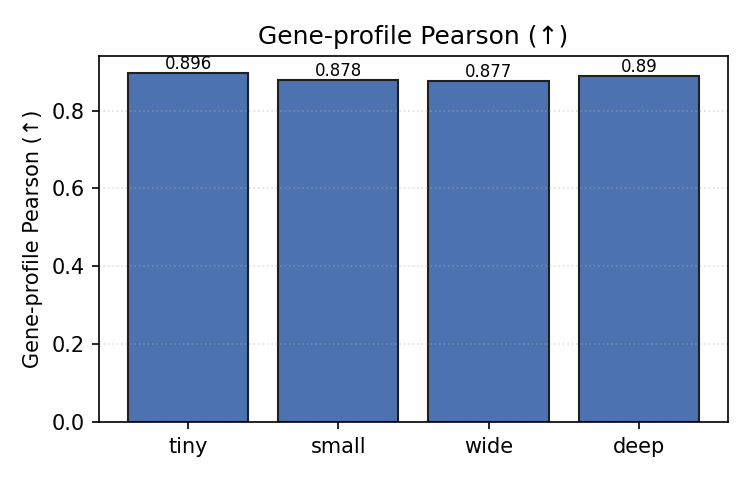
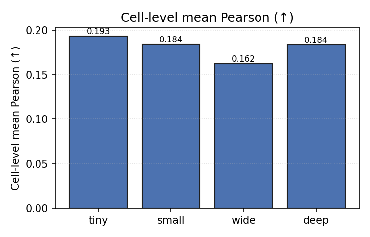
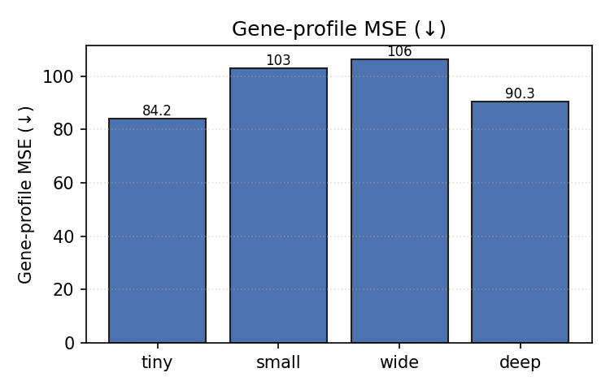
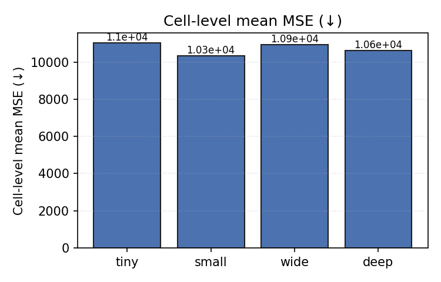

## Resource usage per refined version

| Config | Params | Wall total (s) | Flow train (s) | Reconstruct (s) | Peak GPU (MB) |
|---|---|---|---|---|---|
| `tiny` | 62,830 | 3.27 | 2.72 | 0.55 | 22.0 |
| `small` | 213,710 | 3.93 | 2.38 | 1.55 | 26.0 |
| `wide` | 779,662 | 4.56 | 2.37 | 2.20 | 40.2 |
| `deep` | 363,086 | 5.08 | 2.67 | 2.41 | 33.8 |

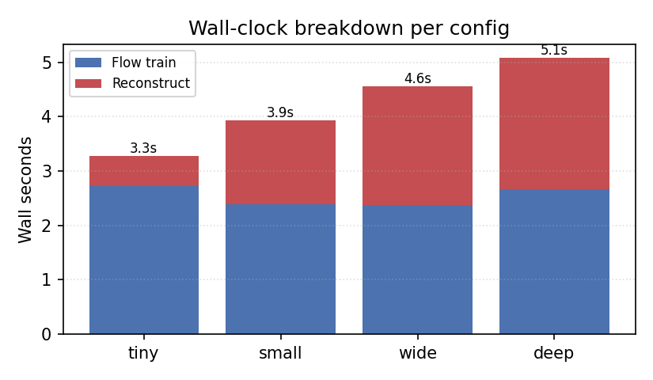

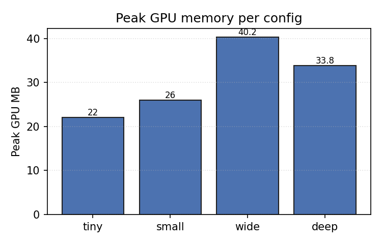

## Training loss curves

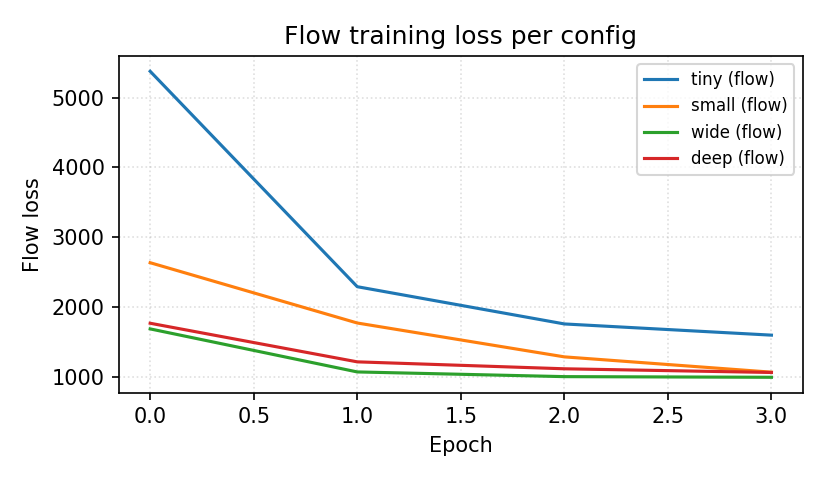

## Reconstructed volume views

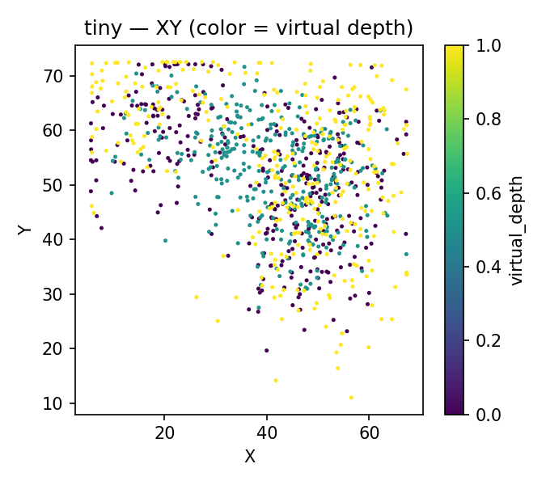

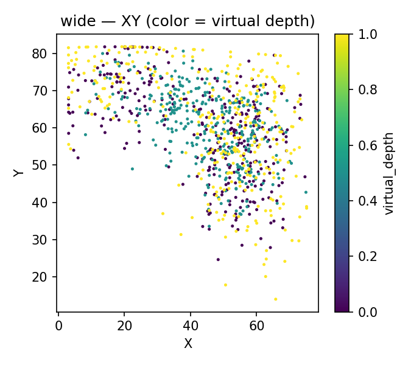

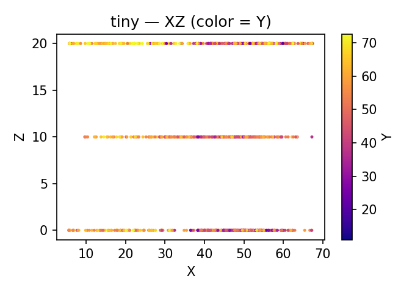
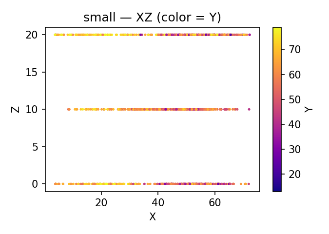
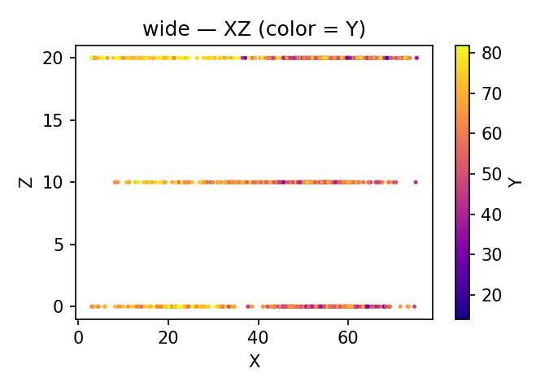
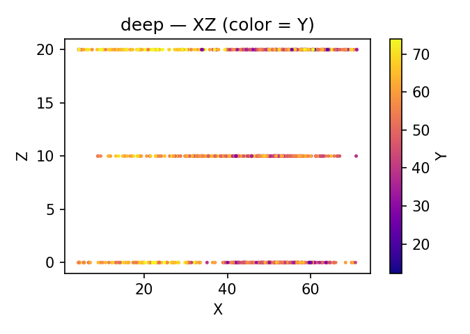

---

Re-run with:

```bash
conda run --no-capture-output -n dl python scripts/benchmark/run_synthetic_sweep.py
# TODO(ref-parity): make_plots.py removed; regenerate plots after real results
```
